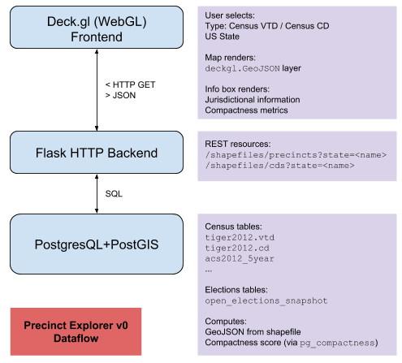

The following document captures some of the underlying motivations and
implementation details for Precinct Explorer.

Goals:
- Create an easy-to-use, extensible, web-based geospatial visualization of
  gerrymandering-related data
- Integrate existing census and electoral data sources, hopefully making it
  easier to not only use them, but also repeatably surface underlying data
  integrity issues and communicate about them with others.
- Use open-source technologies well-matched to their specific focus: PostGIS
  (GIS), javascript and WebGL (interactive applications), and Python (web APIs
  and scientific computing).

This document is also intended to communicate to a technical audience of a wide
skillset, so if there's jargon here, please let us know.

# Software and Data

The following image captures the overall structure of the application:

    

 

(You can edit the drawing on [Google Docs][explorer_v0_drawing], but will need
editing permission.)

Each component has a single responsibility:
- **Frontend**. Captures user interactions, maintains application state, and
  renders data.
- **Backend**: Provides an [interface][rest] for querying data from the database
  and normalizing it for the frontend.
- **Database**: Stores relational data around the Census and a snapshot of
  election results. The database also supports efficient computation,
  aggregation, and joining on geospatial data using [PostGIS][postgis]. The
  database can support rich functionality: for example, we can use PostGIS to
  efficiently (and *accurately*) compute geospatial compactness metrics using
  [pg_compactness][pg_compactness] stored procedures.

[explorer_v0_drawing]: https://docs.google.com/drawings/d/1mtYCwboFaMF5CDZt7BAIrtoNH62SClQ0LC8du4g5G1s/edit
[rest]: https://en.wikipedia.org/wiki/Representational_state_transfer
[postgis]: https://postgis.net/

## Backend

TODO

## Frontend

The frontend is a Javascript [React app][react] that queries the backend for
data to plot:
- The core application lives in [`frontend/app.js`][app_js] and the core UI
  component is [`Root`][app_js_root].
- User actions (e.g., hovering, US state selection) update the `state` property
  of `Root`, and each UI component reads `state` to render.
- As of today, a user can only select a single state and an entity type, such as
  'US Congressional District' or 'Census VTD' (i.e., Census-based voting
  precincts). Selecting a US state or entity type will trigger a callback to the
  backend for shapefiles to render. The data required to render a VTD for a
  medium state can be quite large (~10's of MB).
- We use [Mapbox][mapbox] to render map tiles and [deck.gl][deck.gl] to render
  performant data layers on top of map tiles. To do this, `deck.gl` uses GeoJSON
  `FeatureCollection`s with can also maintain a key-value set of properties for
  each item in the collection. In the demo app, each precinct shape is
  represented as a GeoJSON `MultiPolygon` with a set of properties
  (`county_name`, `entity_name` `polsby_popper`, `schwartzberg`). Certain
  actions, like the user hovering over a shape, will make these properties
  available to be rendered.
- Shapes are assigned random RGBA colors whenever a GeoJSON object is rendered.

[react]: https://reactjs.org/
[mapbox]: https://mapbox.com
[deck.gl]: https://uber.github.io/deck.gl
[app_js]: https://github.com/gerrymandr/precinct-explorer/blob/master/frontend/app.js
[app_js_root]: https://github.com/gerrymandr/precinct-explorer/blob/master/frontend/app.js#L275

## Data Sources

We use PostgresQL (with PostGIS) to store and query two datasets:

- [Census Reporter's PostGIS database][census_reporter_pg]. This is accessed
  through a PG view `precinct_view_2012` to simplify queries from the backend.
- [Open Elections][open_elections]

We also use MGGG's [pg_compactness][pg_compactness] library to accurately
compute geodetically-accurate measures of compactness on PostGIS
shapefiles. Note that this may differ from
[compactnesslib's approach][compactnesslib_issue3].

As of the hackathon, the application uses the Census CD and [VTD][vtd_about]
datasets. Joining these datasets with election data has a number of
issues. Historical election data is frequently difficult to localize,
particularly against census data. This can be for any of a variety of reasons:
- Real electoral precinct maps are ultimately managed at the state-level, but
  there's no nationwide single-source-of-truth. Some efforts, such as
  [Elections Geodata][elections_geodata], collect this data by contacting state
  GIS representatives directly.
- Even within a particular county and state, local election precinct names and
  Census VTD precinct names may be spelled or presented differently. For
  example, 'Congressional District 1, Precinct 12'. vs '01-12'. There's no
  obligation for the precinct identifiers to be identical, and it is therefore
  difficult to use the identifier in one as an index into the other. These two
  datasets may even differ on the number of precincts in a particular county.
- Census VTD's for a particular year and state may be stale (i.e., they reported
  VTD's may not reflect the real electoral geography).

For future work, we'd like to identify some states where it's easier to join
electoral results and census data at the precinct-level.

[pg_compactness]: https://github.com/gerrymandr/pg_compactness
[compactnesslib_issue3]: https://github.com/gerrymandr/compactnesslib/issues/3
[pb_popper]: https://en.wikipedia.org/wiki/Polsby-Popper_Test
[tiger_2012]: https://www.census.gov/geo/maps-data/data/tiger-line.html#tab_2012
[open_elections]: http://www.openelections.net/
[census_reporter_pg]: https://github.com/censusreporter/census-postgres
[openelex_pg]: https://github.com/mookerji/open-elections-postgres
[elections_geodata]: https://github.com/nvkelso/election-geodata
[vtd_about]: http://www.publicmapping.org/resources/data#TOC-Election-Data

# See Also

See MGGG's [open source roadmap][mggg_oss_plan] and
[glossary][mggg_oss_glossary].

[mggg_oss_plan]: https://docs.google.com/document/d/1ep77g68YnQidH8yTh6P3eYaJTsFYbd3lntGGGkBZyJc/edit#
[mggg_oss_glossary]: https://docs.google.com/document/d/1aEl7znLggJW95gRhnefzS3dVE8iE7NZa3VaXZNmok5g/edit#
