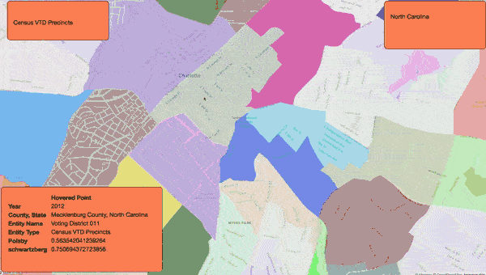

# precinct-explorer

This is the Precinct Explorer tool, created at the
[Geometry of Redistricting Hackathon][sf_hackathon] on 2018-03-18. Precinct
Explorer is a browser application for exploring maps and redistricting-related
[metrics][pb_popper] of precinct-level Census and election data.

    

 

We currently only support visualizing precinct shapefiles from the Census
Bureau's [2012 geographies][tiger_2012], but will extend it to Congressional
Districts and real election [data][open_elections] in the future. See
[Github issues][gh_issues] for ongoing work.

For more details, see the [design document](DESIGN.md).

[sf_hackathon]: https://gerrymandrsanfrancisco.weebly.com
[pb_popper]: https://en.wikipedia.org/wiki/Polsby-Popper_Test
[gh_issues]: https://github.com/gerrymandr/precinct-explorer
[tiger_2012]: https://www.census.gov/geo/maps-data/data/tiger-line.html#tab_2012
[open_elections]: http://www.openelections.net/
[census_reporter_pg]: https://github.com/censusreporter/census-postgres

## Local Development Setup and Usage

Software Prerequisites:
- [PostgresQL][pg_install]
- Python 2.7.x
- Node (>= v9.8.0) and npm (>= 5.6.0)
- A Mapbox [developer token][mapbox_account]

[pg_install]: https://postgis.net/install/
[mapbox_account]: https://www.mapbox.com/signup/?route-to=%22/account/access-tokens/

Data Prerequisites:
- [Census Reporter's Census PostGIS backup][census_reporter_pg]. As mentioned
  below, we have a hosted database of this data that others may use.

[census_reporter_pg]: http://censusreporter.tumblr.com/post/73727555158/easier-access-to-acs-data

The API is in Flask right now and the front end is in node.js. This is not
intentional! @radiantradon plans to move the back-end API to node to remove the
python dependencies.

1. Clone this repo to your computer: `git clone git@github.com:radiantradon/precinct-explorer.git`.
2. Set up a python virtual environment called `precinctexplorer`.
3. Run `pip install -r requirements.txt` inside your python `virtualenv`.
4. Copy envvars-template to a file called envvars (`envvars` is under
   `.gitignore` so it won't get checked into github).
5. Email `radiantradon@gmail.com` (Katherine) or `mookerji@gmail.com` (Buro) for
   access to the database.
6. Run `flask run`.
7. the Flask API is now running at `http://127.0.0.1:5000`

Set up the front end:

8. Run `npm install` to install the node dependencies
9. Run `npm run` (make sure `MapboxAccessToken` is an environment variable)
10. Your site should be at `http://127.0.0.1:8080`

## Database Setup

TODO
